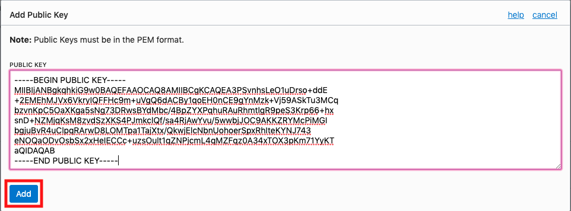

# OCI Terraform Asset - Hub Spoke Network Topology

## Table of Contents

[Overview](#overview)

[Introduction](#introduction)

[Objectives](#objectives)

[Required Artifacts](#required-artifacts)

[Practice 1: Install Terraform on your local machine](#practice-1-install-terraform-on-your-local-machine)

[Practice 2: Create a VCN with Terraform](#practice-2-create-a-vcn-with-terraform)

[Practice 3: Set up OCI CLI for new region](#practice-3-set-up-oci-cli-for-new-region)

## Overview

This architecture shows how to implement a hub-spoke network topology in OCI. The hub is a virtual cloud network (VCN) that is connected to your on-premises network, and the spokes are VCNs that peer with the hub and allow you to isolate workloads. This architecture also demonstrates how to include shared services in the hub that the spokes can then use. You can connect your hub VCN and on-premises network via a VPN connection or Oracle FastConnect.


This hub-spoke topology can help you reduce costs by centralizing services shared by multiple workloads, overcome service limits by peering VCNs from different tenancies with a central VCN, and separate operations between central IT and workloads. This architecture is typically used for workloads run in different environments (production, testing, development, etc.) that share services, workloads that share services but do not require connectivity, and enterprises that require central control over security aspects in the hub yet separate management of the workloads in the spokes.

## Introduction

In this lab, we will install Terraform on your machine, install the Oracle Cloud Infrastructure CLI (Command Line Interface) on your machine, and set up the hub VCN in OCI using the Terraform CLI.

## Objectives

- Install the Terraform CLI
- Install the OCI CLI
- Create a VCN using Terraform CLI

## Required Artifacts

- If running from Windows: [Putty and PuttyGen](https://www.chiark.greenend.org.uk/~sgtatham/putty/latest.html)
- Access to an OCI tenancy
- IntelliJ IDEA from JetBrains. The community version of this IDE can be downloaded [here](https://www.jetbrains.com/idea/).

# Practice-1: Set up OCI CLI and Terraform CLI

You will need to install Terraform to use the Terraform CLI to create resources in OCI.

### **STEP 1**: Download Terraform

- Go to the Terraform [website](https://www.terraform.io/)


- Click the link for your computer's operating system.


- Open up a new Finder window and go to the *Downloads* folder. Verify that a zip file starting with “terraform…” is there.


### **STEP 2**: Install Terraform

- Copy the zip file from the *Downloads* folder. Create a new folder in your *User* folder called *Terraform*. Paste the zip file in this new folder and unzip it. A new executable file called *terraform* should appear.


- Open a new Terminal window. Open the _.bash_profile_ file by typing the following:

  ```
  open ~/.bash_profile
  ```

  This command should open the file in your computer’s default text editor. Add the line shown below to the file, substituting the user _crlamb_ for your own username.

  

  Save and close the file. Enter the following command in the terminal:

  ```
  source ~/.bash_profile
  ```

  Terraform now should be executable system-wide from any directory. Confirm that you can all the `terraform` command by typing the following in your terminal:

  ```
  terraform
  ```

  The result should look like this:

  

### **STEP 3**: Install Oracle Cloud Infrastructure CLI

- In the terminal window, enter the following command:

  ```
  bash -c "$(curl -L https://raw.githubusercontent.com/oracle/oci-cli/master/scripts/install/install.sh)"
  ```

  This command downloads and runs the OCI CLI installer script

  **NOTE**: If you do not have a compatible version of Python installed, you must upgrade your computer’s version of Python. If you are a Mac user, the script will not install it for you. You can download the most recent version of Python [here](https://www.python.org/downloads/).

  When prompted to upgrade the CLI to the newest version, respond with Y to overwrite an existing installation. When prompted to update your PATH, respond with Y to be able to invoke the CLI without providing the full path to the executable. This will add _oci.exe_ to your PATH. Respond with Y with any other prompts the installation script may present.

  

  Your terminal window should look like the above screenshot after a successful installation.

### **STEP 4**: Set up the config file

- Set up the config file with the following command:

  ```
  oci setup config
  ```

  **NOTE**: Use the default location for the config file.

- Enter the user's OCID. You can find the user's OCID in the Console on the page showing the user's details. To get to that page, open the **Profile** menu and click your username. Make a note of the user OCID. You will need it in a future step.

  

  

- Enter the tenancy OCID. It can be found from the **Profile** menu by clicking on the tenancy name. Make a note of the tenancy OCID. You will need it in a future step.

  

  

- Enter the home region of your tenancy in the format specified. You can find the tenancy’s home region on the **Tenancy Information** page. Make a note of this region. You will need it in a future step.

  

- Generate a new RSA key pair. Use the default location and names for the key pair. Leave the passphrase for the private key empty.

  

  The config file is now set up.

### **STEP 5**: Create a compartment

Compartments are used to isolate resources within your OCI tenant. User-based access policies can be applied to manage access to compute instances and other resources within a Compartment.

- Click the **hamburger icon** in the upper left corner to open the navigation menu. Under the **Identity** section of the menu, click **Compartments**

  

- Click **Create Compartment**

  

- In the **Name** field, enter any name you want. For this example we will be using the name *hub-spoke* going forward. Enter a **Description** of your choice. Click **Create Compartment**.

  

- In a moment, your new compartment will show up in the list.

  

- When the compartment appears in the list, click on it to go to the **Compartment Information** page. Copy the **Compartment OCID** somewhere. You will need it in a future step.

  

### **STEP 6**: Add an API Key

When you set up the config file, you generated an RSA key pair. This key pair allows you to use APIs to access and create resources in OCI, but first you must add the public key to your user in the **Console** on your **User Information** page.

- Navigate to your **User Information** page in the **OCI Console** and select **Add Public Key** toward the bottom of the page.  

  

- From the terminal, run the following command, but substitute “crlamb” for the name of your user directory:

  ```
  cat ~/.oci/oci_api_key_public.pem
  ```

  Copy and paste the result in the **Add Public Key** window. Click **Add**.

  

  

- Make a note of the fingerprint generated from this public key. You will need it in the next step.

  

### **STEP 7**: Initialize Terraform

This is the last step before you will be able to use Terraform to create resources in OCI.

- From the terminal, create a new directory under the home directory. Call it *hub-spoke*. Switch into that directory (e.g., `cd hub-spoke`)

  

- Run the command `idea .`. This will open the working directory in IntelliJ, where you will be able to add files to the directory without using the command line.

  

  

- Right click on the name of the directory in the top left corner and select **New --> File**. Name the file *connection.tf*. Click **Ok**.

  

- Add the following code to the file *connection.tf*, then fill in your specific values:

  

  Save the file.

- Back in the terminal, enter the command `terraform init`. This command installs the plugins necessary for Terraform to work with the provider you specified in the previous step. If you entered everything correctly, the command should leave the terminal looking like the following:

  

# Practice-2: Create a VCN with Terraform

### **STEP 1**: Create the hub VCN in Terraform

Now we are going to create a VCN in your OCI compartment using Terraform!

- Create a new file in IntelliJ. Call it *networks.tf*.

  

- Enter the following code in the *networks.tf* file:

  

  Make sure you enter the OCID of your compartment. Save the file.

- In the terminal, enter the command `terraform validate`. This command ensures that all resource blocks are formatted correctly and contain valid values for their arguments. If you entered everything correctly, you should get a success message when the command executes.

  

- Enter the command `terraform apply`. When prompted, enter *yes*. Terraform will begin provisioning the new VCN you specified. You should get a success message as follows:

  

- Confirm the VCN was created by finding it in the **Console**.

  

# Practice-3: Set up OCI CLI for new region
