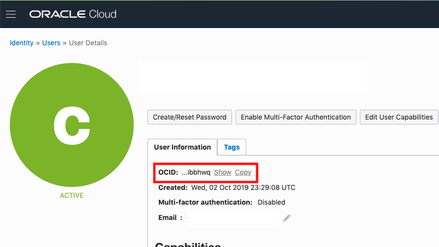
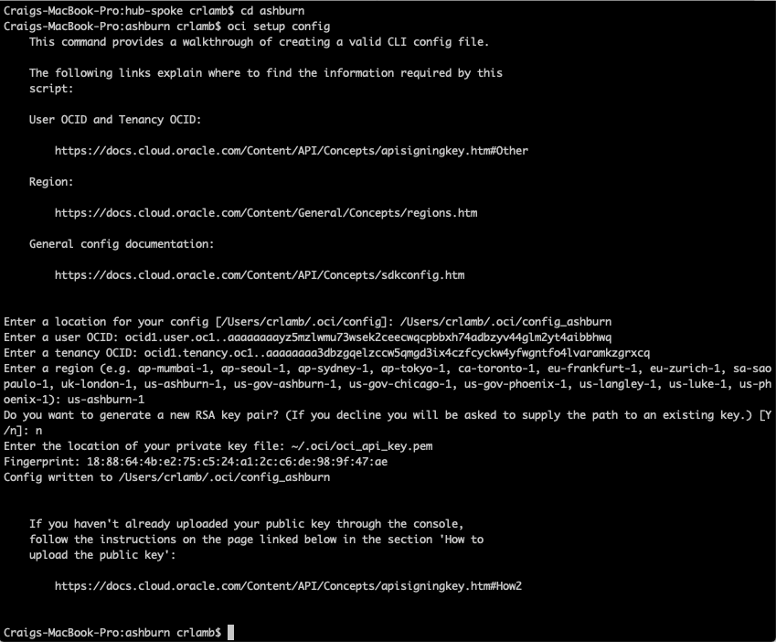
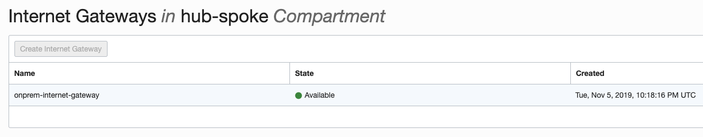
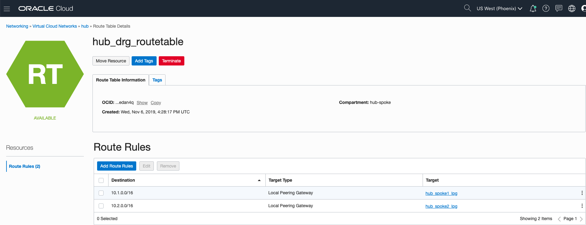
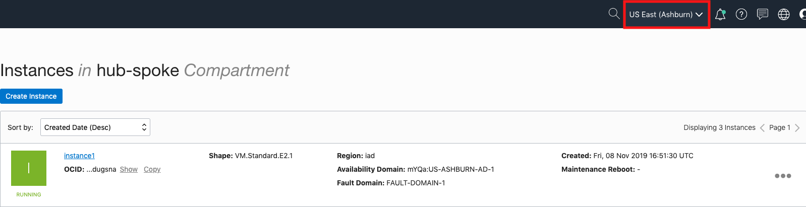

# OCI Terraform Asset - Hub Spoke Network Topology

## Table of Contents

[Overview](#overview)

[Introduction](#introduction)

[Objectives](#objectives)

[Required Artifacts](#required-artifacts)

[Practice 1: Set up OCI CLI and Terraform CLI](#practice-1-set-up-oci-cli-and-terraform-cli)

[Practice 2: Create a VCN with Terraform](#practice-2-create-a-vcn-with-terraform)

[Practice 3: Set up OCI CLI for new region](#practice-3-set-up-oci-cli-for-new-region)

[Practice 4: Create the "On-premises" VCN](#practice-4-create-the-on-premises-vcn)

[Practice 5: Create the remaining VCNs](#practice-5-create-the-remaining-vcns)

[Practice 6: Add subnets to the VCNs](#practice-6-add-subnets-to-the-vcns)

[Practice 7: Add local peering gateways to the hub and spokes](#practice-7-add-local-peering-gateways-to-the-hub-and-spokes)

[Practice 8: Add dynamic routing gateways to the hub and "on-prem" VCNs](#practice-8-add-dynamic-routing-gateways-to-the-hub-and-on-prem-vcns)

[Practice 9: Add internet gateways to the VCNs](#practice-9-add-internet-gateways-to-the-vcns)

[Practice 10: Add route rules to default route tables](#practice-10-add-route-rules-to-default-route-tables)

[Practice 11: Add security rules to default security lists](#practice-11-add-security-rules-to-default-security-lists)

[Practice 12: Add compute instances to the VCNs](#practice-12-add-compute-instances-to-the-vcns)

[Practice 13: Testing transit routing through the hub-spoke architecture](#practice-13-testing-transit-routing-through-the-hub-spoke-architecture)

## Overview

This architecture shows how to implement a hub-spoke network topology in OCI. The hub is a virtual cloud network (VCN) that is connected to your on-premises network, and the spokes are VCNs that peer with the hub and allow you to isolate workloads. This architecture also demonstrates how to include shared services in the hub that the spokes can then use. You can connect your hub VCN and on-premises network via a VPN connection or Oracle FastConnect.


This hub-spoke topology can help you reduce costs by centralizing services shared by multiple workloads, overcome service limits by peering VCNs from different tenancies with a central VCN, and separate operations between central IT and workloads. This architecture is typically used for workloads run in different environments (production, testing, development, etc.) that share services, workloads that share services but do not require connectivity, and enterprises that require central control over security aspects in the hub yet separate management of the workloads in the spokes.

## Introduction

In this lab, we will install Terraform on your machine, install the Oracle Cloud Infrastructure CLI (Command Line Interface) on your machine, and set up the hub VCN in OCI using the Terraform CLI.

## Objectives

- Install the Terraform CLI
- Install the OCI CLI
- Create a VCN using Terraform CLI

## Required Artifacts

- If running from Windows: [Putty and PuttyGen](https://www.chiark.greenend.org.uk/~sgtatham/putty/latest.html)
- Access to an OCI tenancy
- IntelliJ IDEA from JetBrains. The community version of this IDE can be downloaded [here](https://www.jetbrains.com/idea/).

# Practice-1: Set up OCI CLI and Terraform CLI

You will need to install Terraform to use the Terraform CLI to create resources in OCI.

### **STEP 1**: Download Terraform

- Go to the Terraform [website](https://www.terraform.io/)


- Click the link for your computer's operating system.


- Open up a new Finder window and go to the *Downloads* folder. Verify that a zip file starting with “terraform…” is there.


### **STEP 2**: Install Terraform

- Copy the zip file from the *Downloads* folder. Create a new folder in your *User* folder called *Terraform*. Paste the zip file in this new folder and unzip it. A new executable file called *terraform* should appear.


- Open a new Terminal window. Open the _.bash_profile_ file by typing the following:

  ```
  open ~/.bash_profile
  ```

  This command should open the file in your computer’s default text editor. Add the line shown below to the file, substituting the user _crlamb_ for your own username.

  

  Save and close the file. Enter the following command in the terminal:

  ```
  source ~/.bash_profile
  ```

  Terraform now should be executable system-wide from any directory. Confirm that you can all the `terraform` command by typing the following in your terminal:

  ```
  terraform
  ```

  The result should look like this:

  

### **STEP 3**: Install Oracle Cloud Infrastructure CLI

- In the terminal window, enter the following command:

  ```
  bash -c "$(curl -L https://raw.githubusercontent.com/oracle/oci-cli/master/scripts/install/install.sh)"
  ```

  This command downloads and runs the OCI CLI installer script

  **NOTE**: If you do not have a compatible version of Python installed, you must upgrade your computer’s version of Python. If you are a Mac user, the script will not install it for you. You can download the most recent version of Python [here](https://www.python.org/downloads/).

  When prompted to upgrade the CLI to the newest version, respond with Y to overwrite an existing installation. When prompted to update your PATH, respond with Y to be able to invoke the CLI without providing the full path to the executable. This will add _oci.exe_ to your PATH. Respond with Y with any other prompts the installation script may present.

  

  Your terminal window should look like the above screenshot after a successful installation.

### **STEP 4**: Set up the config file

- Set up the config file with the following command:

  ```
  oci setup config
  ```

  **NOTE**: Use the default location for the config file.

- Enter the user's OCID. You can find the user's OCID in the Console on the page showing the user's details. To get to that page, open the **Profile** menu and click your username. Make a note of the user OCID. You will need it in a future step.

  

  

- Enter the tenancy OCID. It can be found from the **Profile** menu by clicking on the tenancy name. Make a note of the tenancy OCID. You will need it in a future step.

  

  

- Enter the home region of your tenancy in the format specified. You can find the tenancy’s home region on the **Tenancy Information** page. Make a note of this region. You will need it in a future step.

  

- Generate a new RSA key pair. Use the default location and names for the key pair. Leave the passphrase for the private key empty.

  

  The config file is now set up.

### **STEP 5**: Create a compartment

Compartments are used to isolate resources within your OCI tenant. User-based access policies can be applied to manage access to compute instances and other resources within a Compartment.

- Click the **hamburger icon** in the upper left corner to open the navigation menu. Under the **Identity** section of the menu, click **Compartments**

  

- Click **Create Compartment**

  

- In the **Name** field, enter any name you want. For this example we will be using the name *hub-spoke* going forward. Enter a **Description** of your choice. Click **Create Compartment**.

  

- In a moment, your new compartment will show up in the list.

  

- When the compartment appears in the list, click on it to go to the **Compartment Information** page. Copy the **Compartment OCID** somewhere. You will need it in a future step.

  

### **STEP 6**: Add an API Key

When you set up the config file, you generated an RSA key pair. This key pair allows you to use APIs to access and create resources in OCI, but first you must add the public key to your user in the **Console** on your **User Information** page.

- Navigate to your **User Information** page in the **OCI Console** and select **Add Public Key** toward the bottom of the page.  

  

- From the terminal, run the following command, but substitute “crlamb” for the name of your user directory:

  ```
  cat ~/.oci/oci_api_key_public.pem
  ```

  Copy and paste the result in the **Add Public Key** window. Click **Add**.

  

  

- Make a note of the fingerprint generated from this public key. You will need it in the next step.

  

### **STEP 7**: Initialize Terraform

This is the last step before you will be able to use Terraform to create resources in OCI.

- From the terminal, create a new directory under the home directory. Call it *hub-spoke*. Switch into that directory (e.g., `cd hub-spoke`)

  

- Run the command `idea .`. This will open the working directory in IntelliJ, where you will be able to add files to the directory without using the command line.

  

  

- Right click on the name of the directory in the top left corner and select **New --> File**. Name the file *connection.tf*. Click **Ok**.

  

- Add the following code to the file *connection.tf*, then fill in your specific values:

  

  Save the file.

- Back in the terminal, enter the command `terraform init`. This command installs the plugins necessary for Terraform to work with the provider you specified in the previous step. If you entered everything correctly, the command should leave the terminal looking like the following:

  

# Practice-2: Create a VCN with Terraform

### **STEP 1**: Create the hub VCN in Terraform

Now we are going to create a VCN in your OCI compartment using Terraform!

- Create a new file in IntelliJ. Call it *networks.tf*.

  

- Enter the following code in the *networks.tf* file:

  

  Make sure you enter the OCID of your compartment. Save the file.

- In the terminal, enter the command `terraform validate`. This command ensures that all resource blocks are formatted correctly and contain valid values for their arguments. If you entered everything correctly, you should get a success message when the command executes.

  

- Enter the command `terraform apply`. When prompted, enter *yes*. Terraform will begin provisioning the new VCN you specified. You should get a success message as follows:

  

- Confirm the VCN was created by finding it in the **Console**.

  

# Practice-3: Set up OCI CLI for new region

Because we do not have easy access to an on-premises network, we can emulate one by creating the “on-prem” network in a VCN in a different region than the hub and spoke VCNs. We can then connect the “on-prem” VCN with the hub VCN using a dynamic routing gateway (DRG) in the same way we would connect a physical on-prem network with the hub VCN. The only difference is that we use a remote peering connecting (RPC) to connect the two VCNs instead of an IPsec VPN or FastConnect connection.

### **STEP 1**: Create a subdirectory to hold the Terraform files for the new region

- Open a terminal window and change to the *hub-spoke* directory created in the previous lab. Run the command `mkdir ashburn`. Our second region will be the US East region in Ashburn, so our subdirectory will reflect that. Change into this directory.

### **STEP 2**: Set up the OCI CLI config file for this subdirectory

- Run the command `oci setup config`. When asked to enter a location for the config file, use the path *~/.oci/config_ashburn*. Enter the same **User OCID** and **Tenancy OCID** you entered in the previous lab. Enter *us-ashburn-1* for the region. DO NOT generate a new RSA key pair; you can use the same key pair you created when you initialized the OCI CLI. Enter the path to that private key: *~/.oci/oci_api_key.pem* (or whichever name/path you gave private key file)

  

### **STEP 3**: Open the directory in IntelliJ

- Run the command `idea .`.

### **STEP 4**: Create new files in the directory

- Create two new files. Name the first file *vcn.tf* and the second file *connection.tf*.

### **STEP 5**: Establish the connection in *connection.tf*

- Copy and paste the code you have in the *connection.tf* file in the *hub-spoke directory* into the *connection.tf* file in the *ashburn* directory. Change the region to **us-ashburn-1**.

# Practice-4: Create the "On-premises" VCN

### **STEP 1**: Add the "on-prem" VCN

- Add the following code to the *vcn.tf* file:

  ```
  resource "oci_core_vcn" "onprem" {
    cidr_block = "192.168.0.0/16"
    compartment_id = "<your_compartment_OCID>"

    display_name = "onprem"
  }
  ```

  **NOTE**: Use the same **Compartment OCID** you used in the other region. This compartment will be used for both regions throughout the lab.

  Save the file.

### **STEP 2**: Create the VCN with Terraform

- In the terminal, run `terraform init` to initialize Terraform in this directory. Validate the resources in Terraform with `terraform validate`. When the code is validated, run the command `echo "yes" | terraform apply`.

  

### **STEP 3**: Verify the VCN was created in the OCI Console

- Log in to the OCI console. From the hamburger menu in the top left of the page, go to **Networking --> Virtual Cloud Networks**. Verify there is a VCN called *onprem* in the list of VCNs. Ensure the region in the top right of the screen says *US East (Ashburn)* and you are in the *hub-spoke* compartment.

  

# Practice-5: Create the remaining VCNs

### **STEP 1**: Open up a terminal window

- Change to the *hub-spoke* directory created in the previous lab. Run the command `terraform init` to verify that the Terraform CLI is ready use in that directory

  

### **STEP 2**: Open the directory in IntelliJ

- Open the directory with the command `idea .`.

### **STEP 3**: Add the VCNs for the spokes

- Beneath the code that creates the hub VCN, add more code create a VCN for two spokes. Use the following parameters:

  *Spoke 1*:
    **cidr_block**: "10.1.0.0/16"
    **compartment_id**: "*<same_as_hub_vcn>*"
    **display_name**: "spoke1"

  *Spoke 2*:
    **cidr_block**: "10.2.0.0/16"
    **compartment_id**: "*<same_as_hub_vcn>*"
    **display_name**: "spoke2"

  Save the file.

  

### **STEP 4**: Create the VCNs

- In the terminal, validate the code you added, then create the resources with `echo "yes" | terraform apply`. Verify the VCNs are created in the **console**.

  

# Practice-6: Add subnets to the VCNs

For the purpose of this lab, the hub VCN will have two subnets and each spoke VCN and the “on-prem” VCN will have one subnet (so that we can create a compute instance in this VCN later on). The hub VCN needs two subnets in order to associate different route tables with the compute instance and the dynamic routing gateway we will be adding. In practice, these VCNs will have more subnets for more specific purposes, such as creating a demilitarized zone (DMZ) in the hub for extra security and management subnets in the spokes for isolating workloads.  

### **STEP 1**: Create a new file in the *hub-spoke* directory

- Create a new file in the *hub-spoke* directory called *subnets.tf*.

### **STEP 2**: Add the subnets to the VCNs

- In the empty *subnets.tf* file, add the following code:

  ```
  resource "oci_core_subnet" "hub_subnet" {
    cidr_block     = "10.0.255.224/27"
    compartment_id = "${oci_core_vcn.hub_vcn.compartment_ocid}"
    vcn_id         = "${oci_core_vcn.hub_vcn.id}"

    display_name = "hub_subnet"
  }
  ```

  One neat feature in Terraform is that it lets you access attributes of a resource through string interpolation, as seen for the arguments `vcn_id` and `compartment_id` above. Instead of storing certain values in custom variables, Terraform keeps track of them after the resource is created so you can reference them directly using the name of the resource you specified at creation.

  Using the above code block as a guide, add the code to add the subnets for the spoke VCNs. Use the following parameters:

    *Hub compute CIDR block*: **10.0.0.32/27**
    *Spoke 1 CIDR block*: **10.1.0.32/27**
    *Spoke 2 CIDR block*: **10.2.0.32/27**

  Save the file.

### **STEP 3**: Create the subnets

- In the terminal, run `echo “yes” | terraform apply` to create the subnets. Verify in the console that the subnets were created. To do so, go to the information page for each VCN and click **Subnets** on the left. A subnet with the display name you specified should be present.

  

### **STEP 4**: Create the subnet in the "on-prem" VCN

- Repeat steps 2-3 above for the VCN in the Ashburn region (the "on-prem" VCN). Use the CIDR block **192.168.1.128/25** for the subnet.

  **NOTE**: You only need 1 subnet in the "on-prem" VCN

# Practice-7: Add local peering gateways to the hub and spokes

### **STEP 1**: Create a new file for local peering gateways

- In the *hub-spoke* directory, create a new file called *lpg.tf*. This file will contain all code related to the local peering gateways in this architecture.

### **STEP 2**: Add the local peering gateway for the first spoke

- In the new file, copy and paste the code below:

  ```
  resource "oci_core_local_peering_gateway" "spoke1-lpg" {
    compartment_id = “${oci_core_vcn.spoke1.compartment_id}”
    vcn_id         = "${oci_core_vcn.spoke1.id}"

    display_name = "spoke1_lpg"
  }
  ```

  Here we can use interpolation for the compartment OCID because the compartment OCID is an attribute of the VCNs we created, and we already used the string literal to create the VCNs.

### **STEP 3**: Add the LPG for the second spoke

- Just below the code above, paste the code again but make the necessary changes to create an LPG for the second spoke.

### **STEP 4**: Add the LPGs for the hub

The hub requires an LPG for each spoke, so in our case it needs 2 LPGs: one for the first spoke and one for the second spoke. However, in order to peer the LPGs in the hub with those in the spokes, we need to actually create 2 more LPGs in the hub, one for each of the spokes.

- Copy and paste the following code to add the LPG that peers the hub with the first spoke:

  ```
  resource "oci_core_local_peering_gateway" "hub_spoke1_lpg" {
    compartment_id = "${oci_core_vcn.hub.compartment_id}"
    vcn_id         = "${oci_core_vcn.hub.id}"

    display_name = "hub_spoke1_lpg"

    peer_id = "${oci_core_local_peering_gateway.spoke1-lpg.id}"
  }
  ```

  Here, the *peer_id* argument represents the OCID of the local peering gateway this LPG would like to peer with. To peer with the first spoke, we need the ID of the LPG in *spoke1*.

- Paste the code above below itself and make the necessary changes to add and peer the second LPG in the hub. Save the file.

### **STEP 5**: Create the LPGs

- In the terminal, run `echo “yes” | terraform apply`. In the **console**, verify the LPGs were created and peered with the appropriate LPG.

  

  

# Practice-8: Add dynamic routing gateways to the hub and "on-prem" VCNs

These dynamic routing gateways (DRGs) will allow us to create a remote peering connection (RPC) between the “on-prem” and hub VCNs in order to simulate an IPsec VPN connection. A remote peering connection is like local peering except that the two VCNs are in different regions.

### **STEP 1**: Create a new file for the dynamic routing gateway

- In the *hub-spoke* directory, create a new file called *drg.tf*.

### **STEP 2**: Add a DRG to the file

- In the new file, copy and paste the code below:

  ```
  resource "oci_core_drg" "hub_drg" {
    compartment_id = "${oci_core_vcn.hub.compartment_id}"

    display_name = "hub_drg"
  }
  ```

### **STEP 3**: Attach the DRG to the hub VCN

- After you create a DRG, it must be attached to a VCN in order for you to use it. To do so, copy and paste the following code below the code you just pasted into *drg.tf*:

  ```
  resource "oci_core_drg_attachment" "hub_drg_attachment" {
    drg_id = "${oci_core_drg.hub_drg.id}"
    vcn_id = "${oci_core_vcn.hub.id}"
  }
  ```

  Here, we set the OCID of the DRG we just made to the *drg_id* argument and the OCID of the hub VCN to the *vcn_id* argument.

### **STEP 4**: Create the hub DRG

- In the terminal, run `echo “yes” | terraform apply`. Verify that the DRG was created in the console.

  

### **STEP 5**: Add, attach, and create the DRG in the "on-prem" VCN

- Switch to the *hub-spoke/ashburn* directory. Repeat steps 1-4 in this directory, making the necessary changes to the arguments specific to the “on-prem” VCN.

  

### **STEP 6**: Create a remote peering connection between the two DRGs

- Back in the *hub-spoke* directory, create a new file called *rpc.tf*. Add the following code:

  ```
  resource "oci_core_remote_peering_connection" "onprem_rpc" {
    compartment_id = "${oci_core_drg.hub_drg.compartment_id}"
    drg_id = "${oci_core_drg.hub_drg.id}"

    peer_region_name = "us-ashburn-1"
  }
  ```

  Save the file and run the command `echo “yes” | terraform apply` in the terminal. In the **console**, verify that the DRG has a pending remote peering connection.

  

  

- In the **console**, copy the **OCID** of the RPC created in the previous actions. Click on the name of the RPC from the DRG info page, then click **Copy** next to the **OCID** of the RPC.

  

  

- In the *hub-spoke/ashburn* directory, create a new file called *rpc.tf*. Copy and paste the code from step 6 into the file, substituting “us-phoenix-1” for the value of the region argument. Paste the following line underneath the argument *peer_region_name*, but substituting in the OCID you just copied:

  ```
  peer_id = "<your_rpc_ocid>"
  ```

  Your *hub-spoke/ashburn/rpc.tf* file should look like the following:

  

  Save the file and build the resource in Terraform with the command `echo “yes” | terraform apply`. The console should reflect the remote peering connection with both DRGs.

  

  

# Practice-9: Add internet gateways to the VCNs

An internet gateway is necessary if you want your VCN to be reachable from the Internet. While these gateways are not required for the hub-spoke network topology, we will add them so that you can SSH into any instances you create in these VCNs.

### **STEP 1**: Add an Internet gateway to the hub VCN

- Create a new file in the *hub-spoke* directory and call it *ig.tf*


- Paste the following code into the file:

  ```
  resource "oci_core_internet_gateway" "hub-ig" {
    compartment_id = "${oci_core_vcn.hub.compartment_id}"
    vcn_id         = "${oci_core_vcn.hub.id}"

    enabled      = true
    display_name = "hub-internet-gateway"
  }
  ```
  The arguments here are similar to those of the other resources you’ve already created. Here. The “enabled” argument ensures that when the Internet gateway is provisioned, traffic can be routed to and from the Internet.

### **STEP 2**: Add Internet gateways to spoke VCNs

- In the same file, paste and modify the above code to add an Internet gateway to each of the spoke VCNs. Your *ig.tf* file should look similar to the following when you’re done.

  

### **STEP 3**: Add an Internet gateway to the "on-prem" VCN

- Repeat steps 1 and 2 in the *hub-spoke/ashburn* directory.

  

### **STEP 4**: Create the Internet gateway

- From both directories, run the command `echo “yes” | terraform apply`. Verify the Internet gateways were created in the console when the command finishes.

  

  

  

  

  **NOTE**: You will need to look at the **Internet Gateways** page under the **Resources** section of the **Virtual Cloud Network Details** page for each VCN you've created to see all the internet gateways.

# Practice-10: Add route rules to default route tables

This network architecture requires each VCN to have multiple route tables in order to properly route traffic from the different sources to the right destinations. Here, we will add route rules to the default route tables in each VCN to route traffic that originates in its respective VCN.

### **STEP 1**: Add route rules to the hub VCN's default route table

- Create a new file in the *hub-spoke* directory called *routetable.tf*.

  

- In this new file, copy and paste the following code:

  ```
  resource "oci_core_default_route_table" "hub_default" {
    manage_default_resource_id = "${oci_core_vcn.hub_vcn.default_route_table_id}"
  }
  ```

  When you create a VCN, it is provisioned with a default route table, security list, and DHCP options. Here, we are creating a Terraform resource to manipulate the hub VCN’s default route table. The second line assigns the OCID of the hub VCN’s default route table to this resource.

- Now we will add route rules. A route table needs route rules in order to enable traffic flow through and out of the VCN. Copy and paste the following code **within the resource block** for the default route table:

  ```
  route_rules {
    network_entity_id = "${oci_core_internet_gateway.hub-ig.id}"

    destination_type = "CIDR_BLOCK"
    destination      = "0.0.0.0/0"
  }
  ```

  The destination “0.0.0.0/0” is a special CIDR block that represents any destination. This route rule says that traffic going anywhere out of the VCN will go through the Internet gateway. This may be concerning because we know the CIDR blocks of our other VCNs and don’t want traffic destined for those VCNs to go through the Internet gateway. Don’t worry, VCNs direct traffic according to the most specific applicable route rule in the associated route table, so when we add more route rules to the route table, traffic destined for our other VCNs will not be routed through the Internet gateway.

- Using the above code block as a guide, add route rules to the default route table for routing traffic to the spoke VCNs and the “on-prem” VCN. Match the VCN with its CIDR block. The entity for traffic going to the “on-prem” VCN will be a DRG, and the entity for traffic going to the spoke VCNs will be a local peering gateway. Your code should look similar to the following when you are done:

  

### **STEP 2**: Add a route table specific to the hub's DRG

- In the *routetable.tf* file, right below the resource for the default route table, add a new route table resource and call it *hub_drg_rt* in Terraform. Add route rules for sending traffic to the respective local peering gateways for spoke 1 and spoke 2. Your resource definition should look similar to the following when you are done:

  

### **STEP 3**: Attach the new route table to a subnet

- Underneath the route table we just added, add the following code:

  ```
  resource "oci_core_route_table_attachment" "hub-drg_attachment" {
    route_table_id = "${oci_core_route_table.hub_drg_rt.id}"
    subnet_id = "${oci_core_subnet.hub_gateway_subnet.id}"
  }
  ```

  This resource tells us which route table we want to associate with which subnet. Here, we want to associate the subnet that will have the dynamic routing gateway with the route table we defined for the DRG.

  

- Run the command `echo "yes" | terraform apply` to build the resources.

  

  

### **STEP 4**: Associate the DRG to the route table

- In the *drg.tf* file, add the following line **within the resource**:

  ```
  route_table_id = "${oci_core_route_table.hub_drg_rt.id}"
  ```

  Your code should look like the following:

  

- Run the command `echo "yes" | terraform apply` to build the association.

### **STEP 5**: Add a route table for the hub's LPGs

- Just like the hub’s DRG needs a route table, the LPGs need their own specific route table and cannot use the hub’s default route table because doing so would create a traffic circuit, which we can’t have. Using the route table definition above as a guide, add a new route table resource to the *routetable.tf* file. This route table only needs one rule, which is to direct traffic destined for the “on-prem” network to the DRG. Your code should look similar to the following when you’re done:

  

- Run the command `echo “yes” | terraform apply` to build the new route table. Verify that the route table was built in the OCI console.

  

  

### **STEP 6**: Associate the new route table with the LPGs

- Just like we did with the DRG, we have to specify in the LPG resources which route table we want to use. In the *lpg.tf* file, add a route table ID like you did for the DRG.

  

  Build the associations with the `echo "yes" | terraform apply`

### **STEP 7**: Add route rules to the other VCNs' default route tables

- Like you did for the hub VCN, create resources for the default route tables in the spoke VCNs and the “on-prem” VCN. You will have to add a *routetable.tf* file to the *hub-spoke/ashburn* directory.

  

  

  

# Practice-11: Add security rules to default security lists

Similar to how each VCN is created with a default route table, each VCN is also created with a default security list. The security lists need rules in order to enable traffic in and out of the VCNs (or subnets more specifically). In this section, we will add security rules to each VCN’s default security list in order to enable SSH access to the compute instances we will create and to allow those instances to ping each other.

### **STEP 1**: Create the default security list resources

- The process here is very similar to that of creating default route tables in Terraform. In the *hub-spoke* directory, create a new file called *securitylist.tf*. Copy and paste the following code into the file:

  ```
  resource "oci_core_default_security_list" "hub_security_list" {
    manage_default_resource_id = "${oci_core_vcn.hub_vcn.default_security_list_id}"
  }
  ```

  Here, we are specifying that we want this default security list resource to pertain to the hub VCN’s default security list. Repeat this resource declaration and make the necessary changes for the spoke and “on-prem” VCNs. You will have to create a *securitylist.tf* file in the *hub-spoke/ashburn* directory.

- Build the resources with the command `echo “yes” | terraform apply`.

### **STEP 2**: Add the security rules to the security lists

Security lists consist of two types of rules: egress rules and ingress rules. Egress rules affect traffic leaving a subnet, and ingress rules affect traffic coming into a subnet. Egress rules specify where traffic leaving a subnet can go, and ingress rules specify from where a subnet can receive traffic. Our security lists will only have one egress rule that enables traffic to be sent to any destination from our subnets. The four ingress rules our security list has contribute to enable SSH and ping capabilities.

- Within the resource for the hub VCN’s default security list, add the following lines:

  ```
  egress_security_rules {
    destination = "0.0.0.0/0"
    protocol    = "all"
    stateless   = false
  }

  ingress_security_rules {
    protocol  = "1"
    source    = "10.0.0.0/16"
    stateless = false

    icmp_options {
      type = 3
    }
  }

  ingress_security_rules {
    protocol  = "6"
    source    = "0.0.0.0/0"
    stateless = false

    tcp_options {
      max = 22
      min = 22
    }
  }

  ingress_security_rules {
    protocol = "1"
    source   = "0.0.0.0/0"

    icmp_options {
      type = 3
      code = 4
    }
  }

  ingress_security_rules {
    protocol = "1"
    source = "0.0.0.0/0"

    icmp_options {
      type = 8
    }
  }
  ```

- Add those lines to the resources for the spoke VCNs’ default security lists. In the “on-prem” VCN’s default security list, add those lines, but for the first ingress rule listed, change the source to **192.168.0.0/16**

  

- Build the security lists with the command `echo “yes” | terraform apply`. Verify the security lists were changed in the OCI console.

  

  

  

  These screens should be consistent with those for the other VCNs as well.

# Practice-12: Add compute instances to the VCNs

Now you will create instances in each of the VCNs. The instances are not a required component of this network architecture, so you will add them using the console instead of Terraform.

- In the **console**, navigate to the **Menu --> Compute --> Instances**

- Click **Create Instance**

- In the **Create Instance Dialog** enter the following:

  - **Name**: instance2
  - **Availability Domain**: AD-1
  - **OS Image**: Oracle Linux 7.7
  - **Instance Type**: Virtual Machine
  - **Instance Shape**: VM.Standard.E2.1.Micro
  - **Virtual Cloud Network**: <name of your hub VCN>
  - **Subnet**: <name of your hub VCN’s compute subnet>
  - Select **Assign a public IP address**
  - Leave the default size for the boot volume
  - Under **Add SSH key**, select **Paste SSH keys**
    - In the terminal, run the command `cat ~/.ssh/id_rsa.pub`

  

    - Highlight and copy the key
    - In the console, paste the key into the **SSH Key** textbox

  

  - Click **Create**

- Repeat the previous step to launch an instance in each of the remaining VCNs (spoke1, spoke2, and onprem). For the onprem VCN, you will have to change the region to Ashburn. Use the only subnet available in each of these VCNs. Choose the same or different shape (depending on capacity). Name the instances *instance1*, *instance3*, *instance4* in the onprem, spoke1, and spoke2 VCNs, respectively.

  

  

# Practice-13: Testing transit routing through the hub-spoke architecture

Once the VCN peering connections are established, and all the related security lists and route table entries are populated, we can do a test through our instances in our VCNs.

Let’s look at the proposed figure at the start of the labs, which shows that the spoke VCNs should have access to the hub VCN, but the spoke VCNs should not be able to talk to each other. Also, the onprem VCN should be able to talk to each of the spoke VCNs in addition to the hub VCN.

- From the terminal, log in to *instance1* in the *onprem* VCN. Use the SSH keys that were used to launch the instances. The default username for Oracle Linux is *opc*.

  ```
  ssh -i </path to the private key> opc@<PublicIPAddress>
  ```

- Once logged in, try to ping the private IPs of other three instances running in the hub VCN and spoke VCNs:

  ```
  ping -c5 10.0.0.X

  ping -c5 10.1.0.X

  ping -c5 10.2.0.X
  ```

  

*Congratulations! You have successfully completed this lab!*
